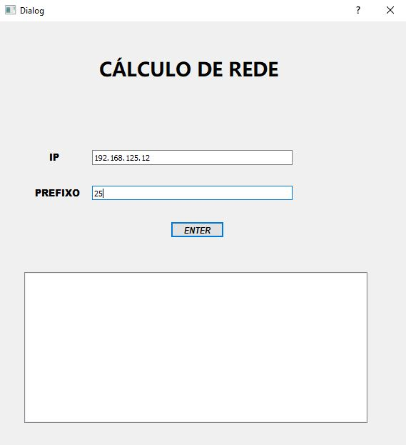
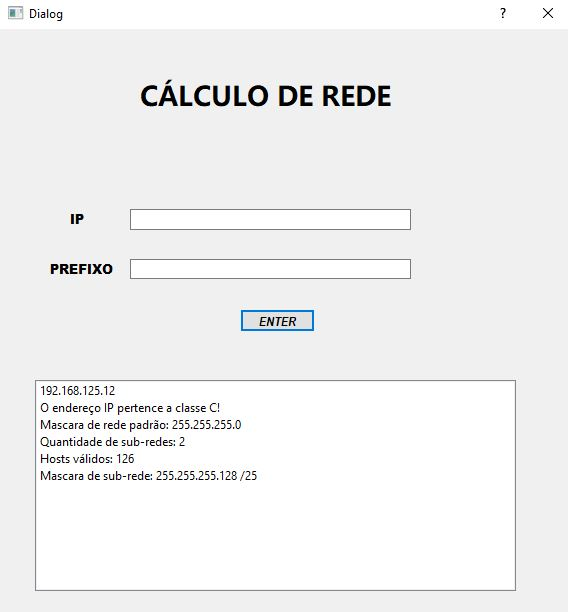
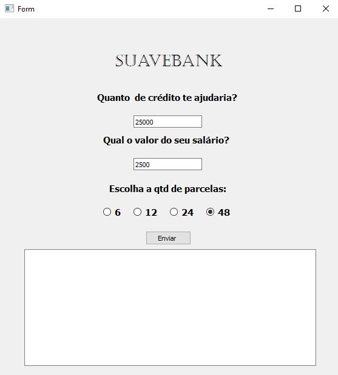
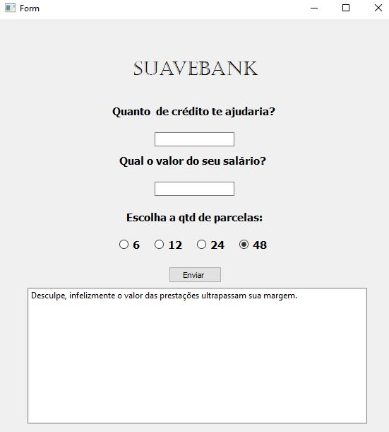
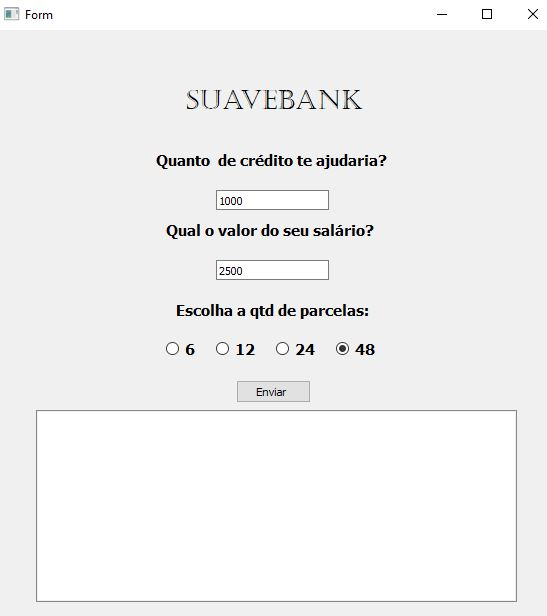
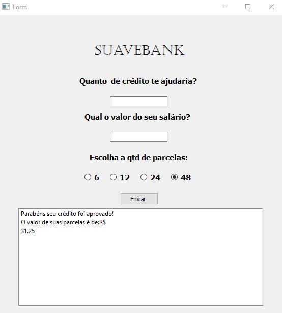
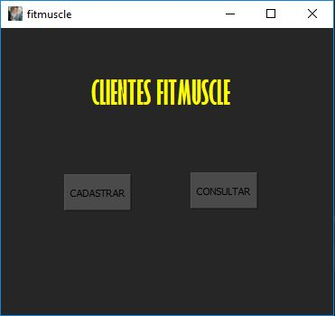
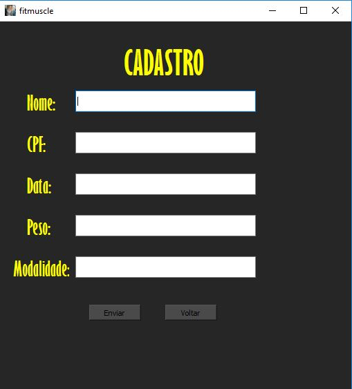
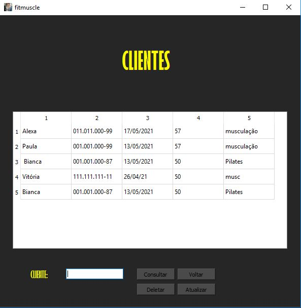

# Softwares desenvolvidos em Python 

# Indice

- [Sobre](#-sobre)
- [Tecnologias Utilizadas](#-tecnologias-utilizadas)

## 🔖&nbsp; Sobre

Projetos desenvolvidos em python para fins de estudo.

  <h1 align="center">Calculador de endereço IP</h1>
  <kbd>
    
  </kbd>
  &nbsp;&nbsp;&nbsp;&nbsp;
  <kbd>
    
  </kbd>
  &nbsp;&nbsp;&nbsp;&nbsp;

  <h1 align="center"> Simulador de empréstimo Bancário </h1>
  <kbd>
    
  </kbd>
  &nbsp;&nbsp;&nbsp;&nbsp;
  <kbd>
    
  </kbd>
  <kbd>
    
  </kbd>
  &nbsp;&nbsp;&nbsp;&nbsp;
  <kbd>
    
  </kbd>  

  <h1 align="center">Cadastro de clientes</h1>
    <kbd>
    
  </kbd> 
  <kbd>
    
  </kbd>
  &nbsp;&nbsp;&nbsp;&nbsp;
  <kbd>
    
  </kbd>
  &nbsp;&nbsp;&nbsp;&nbsp;

## 🚀 Tecnologias utilizadas

O projeto foi desenvolvido utilizando as seguintes tecnologias

- [PyQt5](https://pypi.org/project/PyQt5/)
- [Qt Designer](https://doc.qt.io/qt-5/qtdesigner-manual.html)
- [Psycopg2](https://pypi.org/project/psycopg2/)

Desenvolvido por Luís Henrique.

